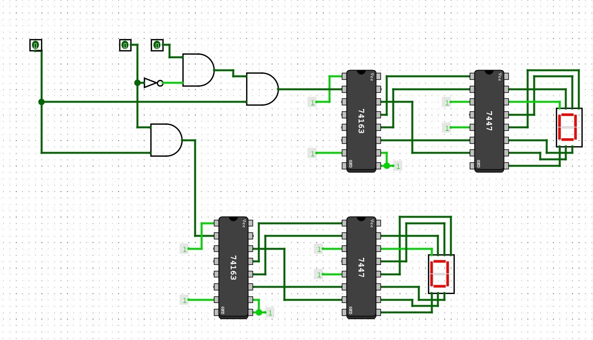
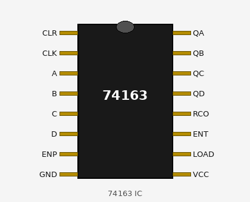
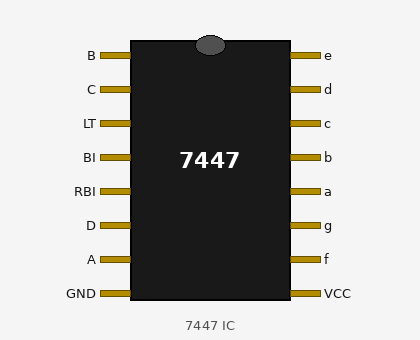
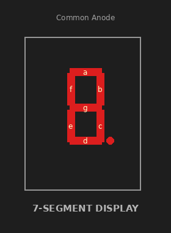
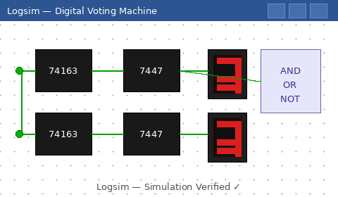

# 🗳️ Digital Voting Machine

> A microcontroller-free electronic voting system built entirely with combinational and sequential digital logic circuits.

[](/)
[](/)
[](/)
[](/)
[](/)

---

## 📋 Table of Contents

- [Abstract](#-abstract)
- [Introduction](#-introduction)
- [Circuit Schematic](#-circuit-schematic)
- [Working Principle](#-working-principle)
- [Components Used](#-components-used)
- [Methodology](#-methodology)
- [Results](#-results)
- [Problems Encountered](#-problems-encountered)
- [Future Improvements](#-future-improvements)
- [Conclusion](#-conclusion)
- [Authors](#-authors)

---

## 📝 Abstract

The **Digital Voting Machine** is a logic-based electronic system designed to record and count votes accurately using digital electronics components — **no microcontroller required**. The system is built entirely on combinational and sequential logic circuits.

Each candidate is represented by a push button. When a voter presses a button, the corresponding vote count increments and is displayed on a **7-segment display**. A **flip-flop locking mechanism** prevents double-voting within a single voting cycle, and counters + decoder ICs handle all vote processing and display.

---

## 🔍 Introduction

Digital electronics underpin virtually all modern technology. This project applies those foundations — logic gates, counters, flip-flops, and display interfacing — to solve a real-world problem: **reliable, tamper-resistant vote counting**.

Traditional paper-based voting is slow and error-prone. This project demonstrates that even without a microcontroller, a secure and efficient voting machine can be constructed from fundamental digital building blocks.

**Key goals:**
- Design a hardware voting machine using only TTL logic ICs
- Prevent multiple votes per cycle using sequential lock logic
- Display live vote counts on 7-segment displays
- Simulate and validate in Logsim before hardware build

---

## 🖥️ Circuit Schematic



*Full circuit simulated in **Logsim**. The design features two voting channels, each with a 74163 counter, a 7447 BCD-to-7-segment decoder, and a 7-segment display. Logic gates at the input handle vote validation and the single-vote lock.*

### Circuit Highlights

| Block | Components | Function |
|---|---|---|
| Input Logic | AND, OR, NOT Gates | Vote validation & mutual exclusion |
| Lock Mechanism | Flip-Flop | Prevents multiple votes per cycle |
| Counter | **74163** (4-bit binary counter) | Increments vote count |
| Decoder | **7447** (BCD to 7-seg) | Converts count to display signal |
| Display | 7-Segment Display | Shows vote count visually |

---

## ⚙️ Working Principle

```
Voter presses candidate button
        │
        ▼
 Logic gates validate input
        │
        ▼
 Flip-flop LOCK activates
 (disables all other buttons)
        │
        ▼
 Counter (74163) increments by 1
        │
        ▼
 7447 decoder converts BCD output
        │
        ▼
 7-segment display shows updated count
        │
        ▼
 Reset button clears all counts
 and unlocks the system
```

1. **Input**: Voter presses a candidate's push button.
2. **Validation**: AND/OR gates verify the signal and prevent simultaneous inputs.
3. **Locking**: Flip-flop changes state after first valid vote, disabling remaining buttons.
4. **Counting**: The validated signal increments the 74163 counter.
5. **Display**: Counter output feeds into the 7447 decoder, driving the 7-segment display.
6. **Reset**: A global reset clears all counters and restores the flip-flop to the ready state.

---

## 🧰 Components Used

| Component | Quantity | Purpose |
|---|---|---|
| 74163 (4-bit Binary Counter) | 2 | Vote counting for each candidate |
| 7447 (BCD to 7-Segment Decoder) | 2 | Converting count to displayable digits |
| 7-Segment Display (Common Anode) | 2 | Displaying vote counts |
| AND Gates | Multiple | Input validation logic |
| OR Gates | Multiple | Signal combining |
| NOT Gate (Inverter) | 1 | Signal inversion for lock logic |
| Push Buttons | 3+ | Candidate selection & reset |
| Flip-Flop | 1 | Single-vote lock mechanism |
| Resistors | Multiple | Current limiting for displays |
| Breadboard / PCB | 1 | Circuit assembly |
| Power Supply (5V DC) | 1 | TTL logic power |

### Key IC Photos

| 74163 — 4-bit Binary Counter | 7447 — BCD to 7-Seg Decoder | 7-Segment Display |
|:---:|:---:|:---:|
|  |  |  |
| Counts votes per candidate | Decodes BCD to display signal | Shows vote count numerically |

---

## 🔬 Methodology

1. **Design Phase** — Circuit designed on paper; truth tables and state diagrams created.
2. **Simulation** — Full circuit verified in **Logsim** before any hardware build.

   
3. **Hardware Build** — Assembled on a breadboard using TTL ICs and discrete components.
4. **Testing** — Each block (input logic, locking, counter, display) tested individually, then as a complete system.
5. **Debugging** — Wiring errors corrected, signal noise addressed, and debounce techniques applied.

---

## 📊 Results

- ✅ Counters accurately responded to valid button presses
- ✅ 7-segment displays correctly showed updated vote counts in real time
- ✅ Flip-flop lock mechanism reliably prevented multiple votes per cycle
- ✅ Reset function cleared all counts and restored the system to the initial state
- ✅ Stable operation confirmed in both Logsim simulation and breadboard hardware

---

## ⚠️ Problems Encountered

| Problem | Cause | Solution |
|---|---|---|
| Multiple counts per press | Switch bouncing | Added debounce logic / capacitor filtering |
| Display errors | Incorrect wiring | Verified pin mapping and rewired |
| False triggering | Circuit noise | Improved grounding and signal stabilization |
| Counter–display sync issues | Timing mismatch | Careful debugging of signal paths |
| Crowded breadboard | Many IC connections | Systematic layout planning |

---

## 🚀 Future Improvements

- [ ] **Password-protected admin access** — Restrict reset and configuration to authorized users
- [ ] **More candidates** — Expand counter width and add more input channels
- [ ] **Buzzer feedback** — Audio indication for valid vote, invalid attempt, and system lock
- [ ] **Invalid vote indicator** — LED or display message for rejected inputs
- [ ] **Backup memory** — Non-volatile storage to preserve counts during power loss
- [ ] **PCB design** — Replace breadboard with a compact, professional PCB layout
- [ ] **Wireless result display** — Transmit results to a remote display or logging system

---

## 🎯 Conclusion

The Digital Voting Machine was successfully designed, simulated, and implemented using only digital logic circuits — no microcontroller. The project proves that fundamental digital components (gates, flip-flops, counters, decoders) are sufficient to build a secure and functional electronic voting system.

The machine correctly counts votes, displays results live, and enforces a one-vote-per-cycle lock. The project deepened practical understanding of TTL IC usage, circuit simulation, and hardware debugging.

---

## 👥 Authors

| Name | Roll |
|---|---|
| **Maisha Fahmida Titly** | 2309003 |
| **Tiaba Alam Orthe** | 2309005 |

**Course**: ECE2104 — Digital Electronics and Logic Circuits Laboratory
**Department**: Electronics and Communication Engineering
**Institution**: Khulna University of Engineering & Technology (KUET), Khulna-9203, Bangladesh

---
 